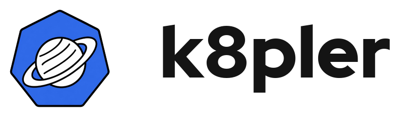
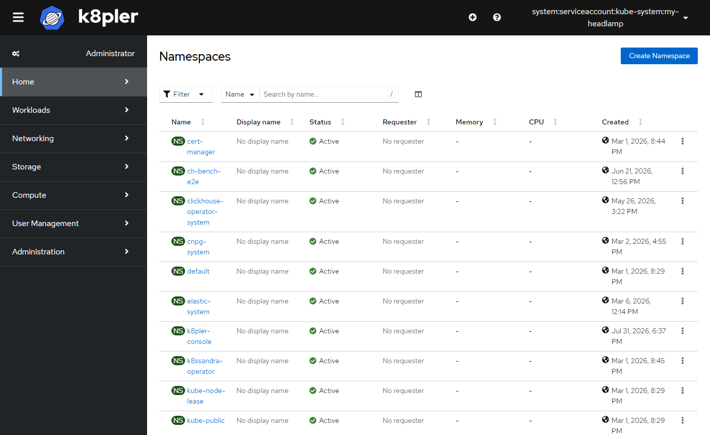

<p align="center">
  
</p>

<p align="center">
  <a href="LICENSE"></a>
  <a href="https://kubernetes.io"></a>
  <a href="charts/k8pler-console"></a>
</p>

Web console for vanilla Kubernetes. Forked from the [OpenShift
Console](https://github.com/openshift/console) at `release-4.16` and stripped of
everything OpenShift-specific.

It runs against a stock Kubernetes API server and authenticates through any
OIDC-compliant provider — Dex, Keycloak, or your own. The architecture is
upstream's: a Go backend ("the bridge") that proxies the Kubernetes API and
serves a React/TypeScript single-page app. [`NOTICE.md`](NOTICE.md) records the
exact fork point and license.



## What's different from upstream

| Removed | Why |
|---|---|
| OLM / OperatorHub and every OLM-dependent plugin (GitOps, Insights, Knative, KubeVirt, Local Storage, Metal3, Pipelines, RHOAS, Service Binding, Shipwright, vSphere, Web Terminal, container security) | No vanilla-Kubernetes equivalent, and unreachable without OLM installed |
| The Developer perspective (`dev-console`, `git-service`) | Built on S2I builds and `DeploymentConfig` rollouts |
| OAuth Users/Groups/Identities pages | Identity is the OIDC provider's job |
| BuildConfigs, Builds, ImageStreams, Templates, Routes, Projects | OpenShift-only APIs. Namespaces and Ingress replace them |

| Kept / added | Notes |
|---|---|
| OIDC authentication (`--user-auth=oidc`) | Already supported upstream; configuration only. See [`docs/RUNNING-ON-KUBERNETES.md`](docs/RUNNING-ON-KUBERNETES.md) |
| Namespaces, Ingress, RBAC, workloads, storage, CRDs | Standard Kubernetes views, unchanged |
| Topology | Restored from upstream and stripped of OLM/Knative/S2I coupling. Lives in the Administrator perspective, not a separate Developer one |
| Helm releases | List, inspect, roll back, and uninstall releases. No chart catalog — that needs an OpenShift-only CRD this fork doesn't carry |
| Observe (Alerts, Silences, Alerting rules, Metrics, Targets) | Backed by Prometheus/Alertmanager, bundled or external — see below |
| "Edit resource limits" modal | Ported locally out of the deleted `dev-console` package |
| A [Helm chart](charts/k8pler-console) | Not upstream. Ships a bundled Dex for quick starts, with optional bundled or external Prometheus |

## Quick start

```bash
helm install k8pler-console ./charts/k8pler-console \
  -f charts/k8pler-console/examples/minimal-values.yaml
kubectl port-forward svc/k8pler-console 9000:80
open http://localhost:9000
```

Other example values in
[`charts/k8pler-console/examples/`](charts/k8pler-console/examples):
`dex-quickstart`, `monitoring-quickstart`, `k3s-lan`, and `production` (external
OIDC provider, TLS ingress). Full configuration reference:
[`charts/k8pler-console/README.md`](charts/k8pler-console/README.md).

Plain manifests instead of Helm: [`deploy/`](deploy/README.md), a hand-written
Dex + console + RBAC set for `kubectl apply -f`.

## Architecture

**Backend ("the bridge")** — Go 1.21+, in `cmd/bridge` and `pkg/`. Proxies the
Kubernetes API under `/api/kubernetes`, serves the compiled frontend, and
handles authentication. Configured entirely by flags; the ones that matter on
plain Kubernetes are in
[`docs/RUNNING-ON-KUBERNETES.md`](docs/RUNNING-ON-KUBERNETES.md).

**Frontend** — React + TypeScript, in `frontend/`. Yarn Berry and webpack; the
compiled output is what the bridge serves. Packages that ship:

- [`console-app`](frontend/packages/console-app) — the Administrator
  perspective: navigation, workloads, RBAC, storage, Helm releases
- [`topology`](frontend/packages/topology) — the topology graph and list views
- [`console-shared`](frontend/packages/console-shared) — shared components and
  hooks
- [`console-dynamic-plugin-sdk`](frontend/packages/console-dynamic-plugin-sdk) —
  the extension API the app is built on
  ([API](frontend/packages/console-dynamic-plugin-sdk/docs/api.md),
  [extensions](frontend/packages/console-dynamic-plugin-sdk/docs/console-extensions.md))
- `console-plugin-sdk`, `console-plugin-shared`, `console-telemetry-plugin`,
  `patternfly`

`console-demo-plugin`, `eslint-plugin-console`, and `integration-tests-cypress`
are development tooling and are not built into the app.

## Building from source

Requires Go 1.21+, Node.js 22+ with
[corepack](https://npmjs.com/package/corepack) enabled, `kubectl`, and a cluster
to point it at. Docker if you would rather build the image than the binaries —
recommended on Windows and macOS, since the build scripts assume POSIX.

```bash
./build.sh                               # bin/bridge, frontend/public/dist, demo plugin
docker build -t k8pler-console:latest .  # or just the container image
```

### Run against a cluster

```bash
export KUBECONFIG=/path/to/kubeconfig
./bin/bridge \
  -k8s-mode off-cluster \
  -k8s-mode-off-cluster-endpoint https://<api-server-host>:6443 \
  -user-auth oidc \
  -user-auth-oidc-issuer-url https://<your-oidc-issuer> \
  -user-auth-oidc-client-id console \
  -user-auth-oidc-client-secret <client-secret> \
  -user-settings-location localstorage \
  -base-address http://localhost:9000
```

Serves [localhost:9000](http://localhost:9000). Full flag reference, including
the `disabled`-auth path for local development without an OIDC provider:
[`docs/RUNNING-ON-KUBERNETES.md`](docs/RUNNING-ON-KUBERNETES.md).

### Frontend development

```bash
cd frontend
yarn install    # once, and whenever dependencies change
yarn run dev    # watches and recompiles on change
```

`HOT_RELOAD=false` disables hot reloading. If changes stop registering, raise
`fs.inotify.max_user_watches` — see the
[webpack docs](https://webpack.js.org/configuration/watch/#not-enough-watchers).

Building natively on Windows requires this repo's pinned Yarn (`corepack
enable` first) and a clean `node_modules` install from a native shell —
`.yarnrc.yml` only lists `linux`/`darwin` in `supportedArchitectures`, so an
install run under Git Bash/MSYS can silently create WSL-style symlinks that
neither Node nor the TypeScript compiler can resolve. Windows/macOS users are
still better off with WSL or Docker.

## Testing

```bash
./test.sh           # everything
./test-backend.sh   # Go only
./test-frontend.sh  # Jest only
```

Cypress integration tests live in
[`frontend/packages/integration-tests-cypress`](frontend/packages/integration-tests-cypress/README.md):

```bash
cd frontend
yarn run cypress install
yarn run test-cypress-console
```

## Contributing

[`CONTRIBUTING.md`](CONTRIBUTING.md) covers workflow conventions,
[`STYLEGUIDE.md`](STYLEGUIDE.md) code style. Both are inherited from upstream
and still apply.

Pin dependency versions exactly — no `^` ranges. For the backend: edit `go.mod`,
run `go mod tidy && go mod vendor`, and commit the `vendor/` change separately
from the code change it supports. For the frontend: `yarn add <package@version>`
or `yarn up <package@version>` from `frontend/`.

## Internationalization

See [`INTERNATIONALIZATION.md`](INTERNATIONALIZATION.md).

## License

Apache License 2.0, inherited from upstream. See [`LICENSE`](LICENSE) and
[`NOTICE.md`](NOTICE.md) for provenance.
